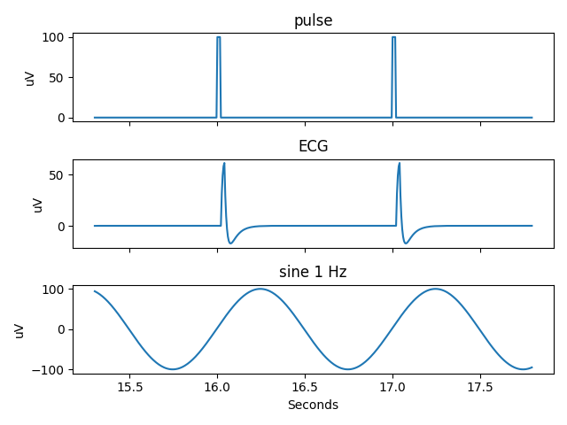

# Reading data from an EDF file

## Simple use

To read data from and EFD file, simply open the file and read the signal
of interest. To illustrate this, the Python code that follows uses a
sample EDF test file ("test_generator_2") downloaded from [EDFBrowser
testfiles](https://www.teuniz.net/edf_bdf_testfiles/). The code can be
run on an interactive `ipython` shell with `matplotlib` for plotting.

```python
# Import the relevant edfrw function.
from edfrw import open_edf

# Open the file in reading mode (the default).
>>> edf = open_edf('test_generator_2.edf')

# Use `print` to display a summary of the file.
>>> print(edf)
Subject ID:         X X X X
Recording ID:       Startdate 10-Dec-2009 X X test_generator
Start date:         2009-12-10
Start time:         12:44:02
Duration:           0:10:00
Nr of data records: 600
Dur of data record: 1.0
Nr of signals:      12
Signal labels:      ['squarewave', 'ramp', 'pulse', 'ECG', 'noise', 'sine 1 Hz', 'sine 8 Hz', 'sine 8.5 Hz', 'sine 15 Hz', 'sine 17 Hz', 'sine 50 Hz', 'EDF Annotations']

# `print` also works on the record header. Try e.g.
# print(edf.header)

# Read and plot the first 5 seconds of data stored in the signal
# "sine 1 Hz".
>>> x, y = edf.read_signal("sine 1 Hz", from_second=0, to_second=5)
>>> plot(x, y)

# Close the file if it is no longer required.
>>> edf.close()
```


Instead of using the signal name, it is possible to refer to a signal by
its index (starting from 0). Thus, to read a few seconds of signal
 "ramp", which is in position 1:

```python
>>> edf = open_edf('test_generator_2.edf')
>>> x, y = edf.read_signal(1, from_second=10.5, to_second=12.2)
>>> edf.close()
>>> plot(x, y)
```


## Signal information

EDF signals are stored in a list in the main edf file handle:

```python
>>> edf = open_edf('test_generator_2.edf')
>>> edf.signals
[<EDFSignal squarewave>,
 <EDFSignal ramp>,
 <EDFSignal pulse>,
 <EDFSignal ECG>,
 <EDFSignal noise>,
 <EDFSignal sine 1 Hz>,
 <EDFSignal sine 8 Hz>,
 <EDFSignal sine 8.5 Hz>,
 <EDFSignal sine 15 Hz>,
 <EDFSignal sine 17 Hz>,
 <EDFSignal sine 50 Hz>,
 <EDFSignal EDF Annotations>]
```

This list can be used to inspect signals individually. For example, to
see the properties of the first signal (i.e. signal 0),

```python
>>> sig = edf.signals[0]
>>> print(sig)
label                            squarewave
transducer_type                  
physical_dim                     uV
physical_min                     -1000.0
physical_max                     1000.0
digital_min                      -32768
digital_max                      32767
prefiltering                     
number_of_samples_in_data_record 200
reserved                         
sampling_freq                    200.0
gain                             0.030518043793392843
```

Moreover, this information is useful for e.g. labelling the plots.
Consider the following script for reading and plotting (with
[Matplotlib](https://matplotlib.org)) a few seconds of data from three
different signals from the same test file as above:

```python
import matplotlib.pyplot as plt

from edfrw import open_edf

# Indices of the three signals of interest.
signals = [2, 3, 5]

# Time range (in seconds).
time_from = 15.3
time_to = 17.8

# Open the EDF file and make a new figure.
edf = open_edf('test_generator_2.edf')
fig, axs = plt.subplots(3, 1, sharex=True)

for (i, signal_index) in enumerate(signals):    
    # Read signal data and plot.
    x, y = edf.read_signal(signal_index, time_from, time_to)
    axs[i].plot(x, y)
    
    # Label the plots with the relevant units and title.
    sig = edf.signals[signal_index]
    axs[i].set_ylabel(sig.physical_dim)
    axs[i].set_title(sig.label)
edf.close()

# Time units in EDF is always seconds.
axs[-1].set_xlabel("Seconds")

# Display
plt.tight_layout()
plt.show()
```



## Additional functions

The module [edfrw.reader][] provides additional functions for reading
EDF data. These are probably most useful for larger applications where
it may be convenient to read raw data from each block (i.e. data
record), or to iterate along data blocks, etc.

The function [`read_record`][edfrw.reader.EdfReader.read_record] reads
data from a given record (indexed from 0) and returns it raw, as stored
by edf. The recipient then must unpack and convert the data samples as
required.

```python
>>> edf = open_edf('test_generator_2.edf')
>>> samples = edf.read_record(0)

>>> size(samples)
4502

>>> samples[:10]
b'\xcc\x0c\xcc\x0c\xcc\x0c\xcc\x0c\xcc\x0c'

>>> type(samples)
bytes
```

A related function,
[`read_signal_from_record`][edfrw.reader.EdfReader.read_signal_from_record]
also reads data from only one edf data block (i.e. a record), but
unpacks the data and converts to physical values. It may be used as the
building block for larger EDF reading applications.


## Limitations

Currently, **edfrw** only works for reading EDF files. Data from EDF+C
(i.e. continuous recording with annotations) files can also be read but
the "EDF Annotations" signal will not be properly parsed. EDF+D files
(i.e. interrupted recording) are not supported.